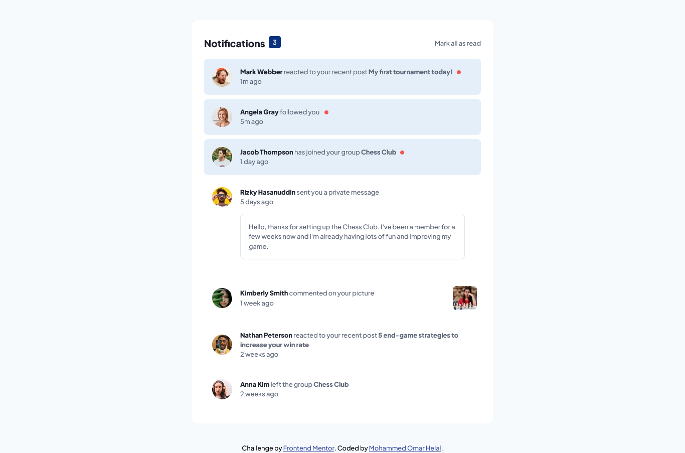
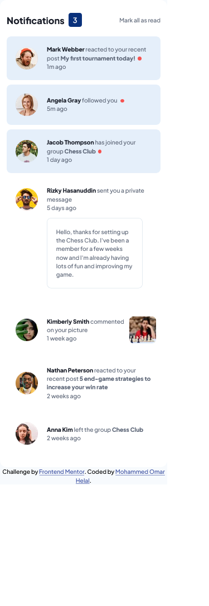

# Frontend Mentor - Notifications page solution

This is a solution to the [Notifications page challenge on Frontend Mentor](https://www.frontendmentor.io/challenges/notifications-page-DqK5QAmKbC). Frontend Mentor challenges help you improve your coding skills by building realistic projects.

## Table of contents

- [Overview](#overview)
  - [The challenge](#the-challenge)
  - [Screenshot](#screenshot)
  - [Links](#links)
- [My process](#my-process)
  - [Built with](#built-with)
  - [What I learned](#what-i-learned)
- [Author](#author)

## Overview

### The challenge

Users should be able to:

- Distinguish between "unread" and "read" notifications
- Select "Mark all as read" to toggle the visual state of the unread notifications and set the number of unread messages to zero
- View the optimal layout for the interface depending on their device's screen size
- See hover and focus states for all interactive elements on the page

### Screenshot

### Links

- Notification page repo: [Notification page repo](https://github.com/MohammedHelal/notifications-page)
- Notification page live site: [Notification page live site](https://mohammedhelal.github.io/notifications-page)

## My process

### Built with

- Semantic HTML5 markup
- CSS custom properties
- Flexbox
- CSS Animations
- [React](https://reactjs.org/) - JS library
- [Vite JS](https://vitejs.dev/) - React Build Tool

### What I learned

I learned a lot building the counter most of all, my aim was to minimize the amount of code I would have to write and build one component for all the notification cards and still be able to track the state of each one.

I also included an inital state of unread notifications and ended up using useEffect hook to render the inital state of the notification cards.

All in all this was a lot of fun to build.

## Author

- CodeSandBox - [MohammedHelal](https://codesandbox.io/u/MohammedHelal)
- Frontend Mentor - [@MohammedHelal](https://www.frontendmentor.io/profile/MohammedHelal)
